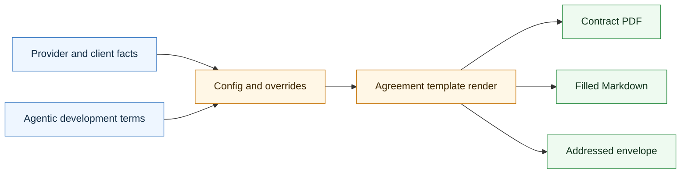

# Agentic Contract Skill

A configurable, branded PDF skill for CompleteTech LLC Agentic Development Services Agreements.

## Workflow Diagram



## Quick Start

```bash
pip install -r requirements.txt

python generate_contract.py --config config.ini \
  --out output/agentic_development_contract_demo.pdf
```

The contract generator creates:

- A PDF contract at the `--out` path.
- A filled Markdown source file beside the PDF unless `--markdown-out` is provided.
- A separate printable #10 envelope PDF unless disabled.

## Overrides

Pass multiple INI files; later files override earlier files:

```bash
python generate_contract.py \
  --config config.ini examples/minimum_client_override.ini \
  --out output/acme_contract.pdf \
  --envelope-out output/acme_envelope.pdf
```

Skip the envelope for one run:

```bash
python generate_contract.py --config config.ini --out output/no_envelope_contract.pdf --no-envelope
```

## Branding Assets

- `assets/logo.png` - CompleteTech LLC primary logo, used on contract cover and letterhead.

## Toggles

In `[branding]`:

```ini
watermark_enabled = yes
watermark_text = DEMO DRAFT
cover_page_enabled = yes
letterhead_enabled = yes
header_enabled = yes
footer_enabled = yes
envelope_enabled = yes
```

## Legal Note

The contract template is a demonstration template, not legal advice. Replace it with counsel-reviewed terms before any real engagement.
